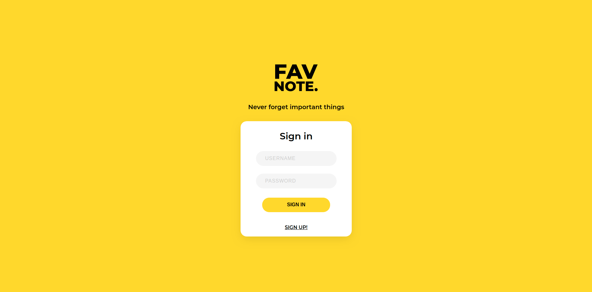
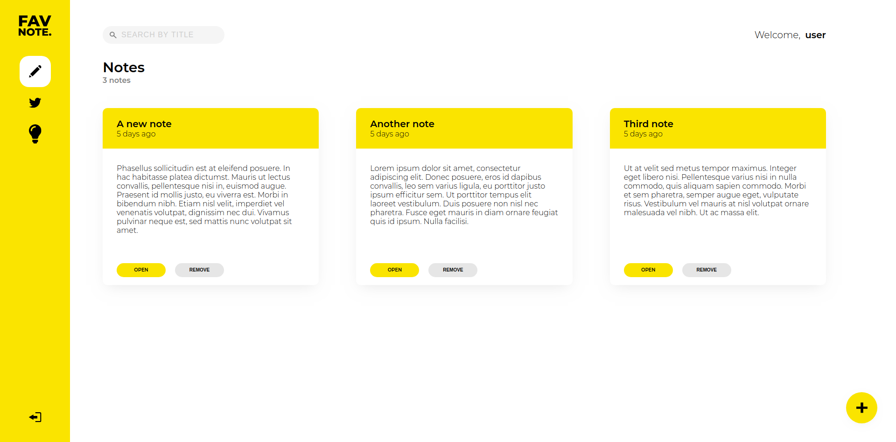
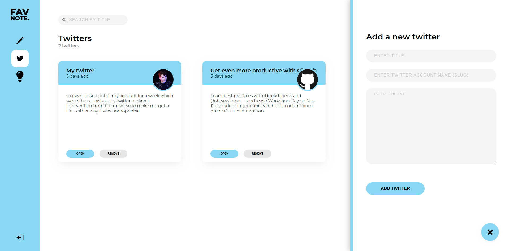
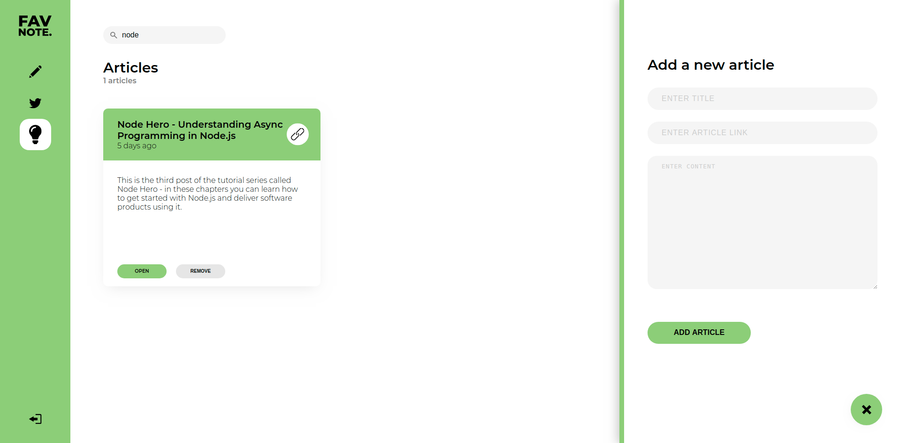
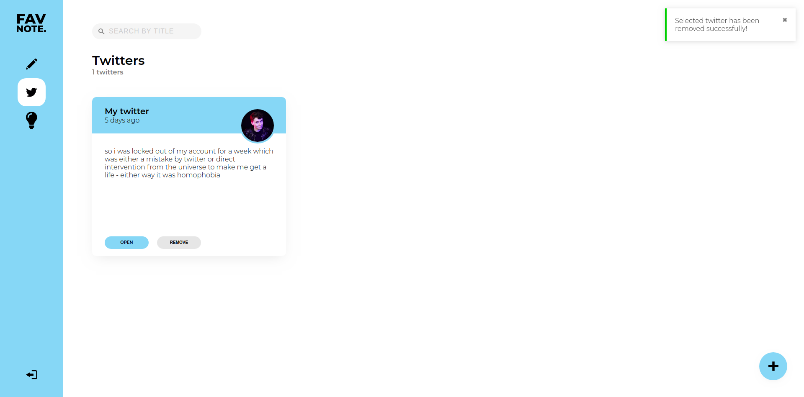

# FavNote App

This is a FavNote application for collecting important stuff from web in order to not forget it. It allows to save your favorite twitters and articles to read them later. You can also add some notes with your brilliant ideas.

## Main functionalities and features

The app provides functionalities such as:

- Adding and removing items (notes/twitters/articles)
- Browsing added items
- Searching by key words in items titles and content in real time
- Toast notifications
- App color theme depends on what you are focus on: notes - yellow, twitters - blue, articles - green.
- Signing in & Signing up
- Atomic design of app components

## Technologies and tools

Project is created with:

- React 16
- React Router
- React Hooks
- Redux
- Styled Components
- JWT
- Storybook
- Axios
- Formik
- React Toastify
- Husky with lint-staged

## Screenshots

Notes view\\

_Adding a new twitter_\\

_Adding a new article_\\

_Article details view_\\

_Toast notifications_\\

## Sources

This app is based on a tutorial by Adam Romański „Kurs React w Praktyce” (https://eduweb.pl/kursy/javascript/react-w-praktyce.html)
